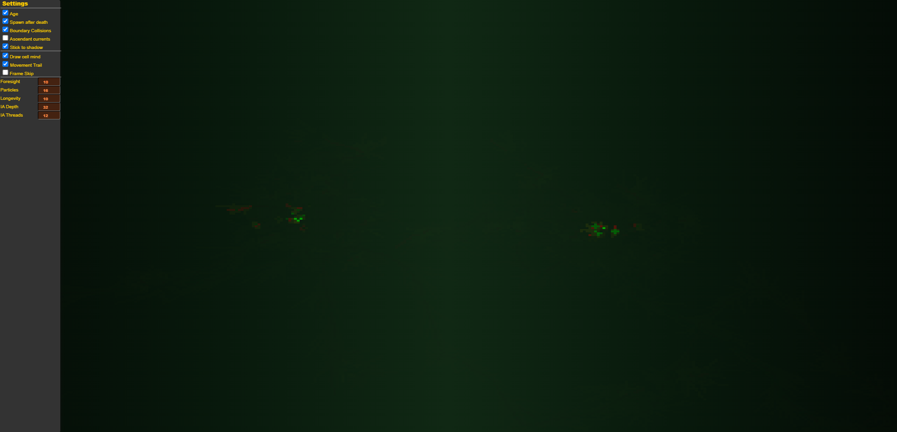
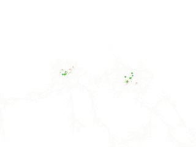

# Cells


## Project Description
This is a Cell Social Life Simulator.\
Cells can move freely, but they are restrained to some rules:
  - To move a cell must decide a direction first.
  - Once a direction is chosen, a set of paths is calculated, each path with different randomness.
  - Then, one of those paths is chosen, also randomly, and the cell begins traversing the path.
  - The cell will recalculate the path randomly while walking on a path.
  - Path length is also random.

There are some tweakable (experimental) parameters.\
To reach them, move the mouse to the left side of the canvas, and a toolbox will show. 

Live Demo: https://cells.iskarion.ddns.net/



## Install / Deploy Instructions
 1. Clone Repository
    ```bash
    git clone git@github.com:pinakure/Cells.git /src/cells
    ```
 2. Get up the container
    ```bash
    cd /src/cells
    docker compose up --build -d
    ```

## Generating Random Pixelart
The cells will leave a mark on the canvas. If they are left doing their stuff a while, a neat random pixelart can be downloaded by right-clicking the screen, then selecting **'Save picture as'**



